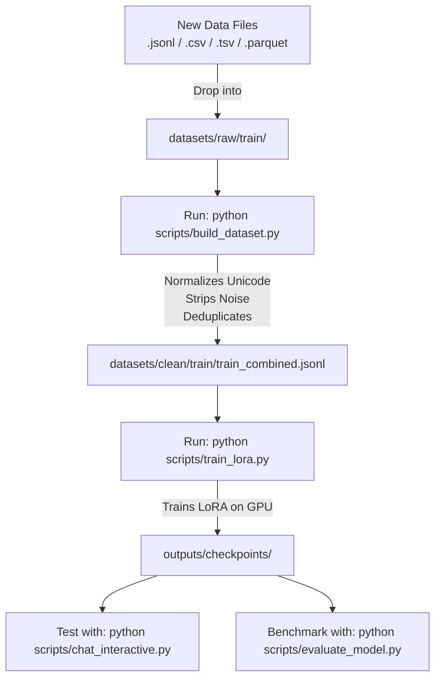

# Comprehensive Guide: Training & Dataset Pipeline

This guide explains how to prepare datasets, handle different file formats (`.jsonl`, `.parquet`, `.csv`, `.tsv`, `.json`), clean Myanmar text, and train your model step-by-step on your RTX 5060 Ti (16GB).

---

## 1. Supported Dataset Formats & Schemas

The dataset compiler ([scripts/build_dataset.py](file:///c:/Users/Htet%20Oo%20Wai%20Yan/Desktop/4ITProject/Project/scripts/build_dataset.py)) automatically detects, cleans, and converts all of the following file types and column structures:

### Supported File Extensions
* `.jsonl` (JSON Lines)
* `.parquet` (Apache Parquet / Hugging Face datasets)
* `.csv` (Comma-Separated Values)
* `.tsv` (Tab-Separated Values)
* `.json` (JSON Array)

---

### Supported Column / Key Structures

#### A. Standard Chat Format (`.jsonl` / `.json`)
```json
{
  "messages": [
    {"role": "system", "content": "သင်သည် အကူအညီပေးသော မြန်မာ AI လက်ထောက်တစ်ဦး ဖြစ်ပါသည်။"},
    {"role": "user", "content": "နေကောင်းလားခင်ဗျာ။"},
    {"role": "assistant", "content": "မင်္ဂလာပါခင်ဗျာ၊ နေကောင်းပါတယ်။ ဘာများကူညီပေးရမလဲ။"}
  ],
  "tags": "greeting"
}
```

#### B. Alpaca / Instruction Format (`.jsonl`, `.csv`, `.parquet`)
Columns or JSON keys: `instruction`, `input` (optional), `output`.
```json
{
  "instruction": "အင်တာနက် လုံခြုံရေးအတွက် အကြံပြုချက် ၃ ချက် ပြောပြပေးပါ။",
  "input": "",
  "output": "၁။ Password အားကောင်းအောင် ထားပါ။\n၂။ 2-Factor Authentication သုံးပါ။\n၃။ မသင်္ကာဖွယ် Link များကို မနှိပ်ပါနှင့်။"
}
```

#### C. Question & Answer Format (`.csv`, `.tsv`, `.parquet`)
Columns or JSON keys: `question` & `answer` OR `prompt` & `response` OR `user` & `assistant`.
| question / prompt / user | answer / response / assistant |
| :--- | :--- |
| Deadlock ဆိုတာဘာလဲ။ | Process များ Resource များကို အပြန်အလှန်စောင့်ဆိုင်းနေသော အခြေအနေဖြစ်ပါသည်။ |
| Physical Layer ရဲ့ အလုပ်က ဘာလဲ။ | Data bits များကို signal အဖြစ်ပြောင်းလဲပေးပါသည်။ |

#### D. Translation Format (`.csv`, `.tsv`, `.parquet`)
Columns or JSON keys: `en` & `my` OR `source` & `target` OR `english` & `burmese`.
| en | my |
| :--- | :--- |
| How are you today? | ဒီနေ့ နေကောင်းလားခင်ဗျာ။ |
| Thank you very much. | အများကြီး ကျေးဇူးတင်ပါတယ်ခင်ဗျာ။ |

---

## 2. Step-by-Step Training Workflow



---

### Step 1: Add Your New Data Files
Place your new raw dataset files (`.jsonl`, `.csv`, `.tsv`, `.parquet`) into:
```
datasets/raw/train/
```
*(You can drop multiple files of different formats at once.)*

---

### Step 2: Compile & Clean the Datasets
Run the dataset compiler:
```powershell
python scripts/build_dataset.py
```
**What this script does automatically:**
1. Scans all files across `datasets/raw/train/`, `datasets/clean/train/`, and `datasets/trained/train/`.
2. Strips synthetic hashtag noise (e.g. `#4618`) and invalid formatting.
3. Applies Unicode NFC normalization to fix Burmese characters and tone-mark ordering.
4. Deduplicates identical question-answer pairs.
5. Produces a clean, unified 3-way split in one go:
   - `datasets/clean/train/train_combined.jsonl` (Training data, 90% by default)
   - `datasets/clean/validation/validation_combined.jsonl` (Validation data, 5% by default)
   - `datasets/clean/test/test_combined.jsonl` (Test evaluation data, 5% by default)

*(Optional: adjust split ratios with `python scripts/build_dataset.py --val-ratio 0.05 --test-ratio 0.05`)*

---

### Step 3: Run LoRA Fine-Tuning
Start training the model with your RTX 5060 Ti:
```powershell
python scripts/train_lora.py
```

#### Customizing Training Hyperparameters (Optional):
You can pass custom CLI arguments to adjust training settings:
```powershell
python scripts/train_lora.py --epochs 3 --batch_size 1 --grad_accum 4 --learning_rate 2e-4 --lora_r 64
```

| Parameter | Default | Recommended Range | Description |
| :--- | :--- | :--- | :--- |
| `--epochs` | `3` | `2` – `4` | Number of passes over the entire dataset |
| `--batch_size` | `1` | `1` – `2` | Batch size per GPU step (keep `1` for 16GB VRAM) |
| `--grad_accum` | `4` | `4` – `8` | Gradient accumulation (Effective batch size = `batch_size * grad_accum`) |
| `--learning_rate` | `2e-4` | `1e-4` – `3e-4` | Peak learning rate for LoRA |
| `--lora_r` | `64` | `32` – `64` | LoRA rank (higher = more expressive capacity) |
| `--lora_alpha` | `128` | `2 * lora_r` | LoRA scaling factor |
| `--max_seq_length` | `2048` | `1024` – `2048` | Maximum token sequence length |
| `--save_total_limit`| `2` | `1` – `3` | Maximum intermediate checkpoints retained on disk |

---

### Step 4: Chat with Your Trained Model
Launch the interactive real-time terminal chat:
```powershell
# Chat with your trained LoRA model
python scripts/chat_interactive.py

# Chat with the original Base model (for comparison)
python scripts/chat_interactive.py --base
```
*Inside the chat, type in Burmese or English. Type `clear` to reset history, or `exit` to quit.*

---

### Step 5: Run Automated Benchmark Evaluation
Run the model against the 25 standardized Burmese benchmark questions across 6 core domains:
```powershell
# 1. Evaluate your trained LoRA model
python scripts/evaluate_model.py

# 2. Run a side-by-side comparison (Base Model vs. LoRA Model)
python scripts/evaluate_model.py --compare

# 3. Evaluate directly on the held-out test split (test_combined.jsonl)
python scripts/evaluate_model.py --test_set --max_samples 50

# 4. Evaluate the Base model only
python scripts/evaluate_model.py --base
```
*Both Markdown (`.md`) and Text (`.txt`) reports with performance metrics and response comparisons are automatically saved to `outputs/evaluations/results/`.*

---

## 3. Storage & Checkpoint Management

* **Intermediate Checkpoints:** During training, Hugging Face saves temporary step folders like `checkpoint-500/`. The script automatically maintains `save_total_limit=2`, keeping only the best 2 checkpoints and automatically deleting older ones.
* **Final Saved Model:** When training finishes, the final LoRA adapter is exported to:
  ```
  outputs/checkpoints/adapter_model.safetensors
  outputs/checkpoints/adapter_config.json
  ```
* You can safely run training multiple times; each run starts cleanly from the base model + combined dataset and saves the new adapter into `outputs/checkpoints/`.

---

## 4. Troubleshooting & Best Practices

| Problem | Cause | Solution |
| :--- | :--- | :--- |
| **CUDA Out of Memory (OOM)** | Sequence length too high or large batch size | Keep `--batch_size 1` and ensure `--max_seq_length 2048` (or lower to `1536`). |
| **Model repeats itself** | Repetition penalty or low temperature | Generation defaults in `scripts/utils/generation_utils.py` are set to `repetition_penalty: 1.15` and `temperature: 0.7`. |
| **Model speaks English instead of Burmese** | Dataset contains too many English samples | Run `python scripts/build_dataset.py` to filter non-Burmese data before training. |
| **Old checkpoints taking up storage** | Previous unmanaged training runs | The updated training script automatically caps checkpoints at 2. |
